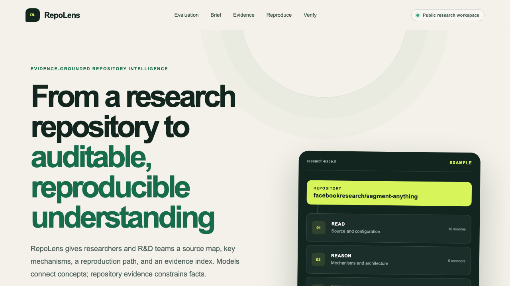

# RepoLens

Source-grounded repository analysis for research and software projects.

[Web application](https://repolens.lsw-research-code.workers.dev) · [macOS download](https://github.com/lsw24-cpu/repolens/releases/latest)



RepoLens reads a public GitHub repository, identifies the files relevant to a selected task, and links its report to source at a fixed revision.

## Workflow

1. Enter a public GitHub repository and select a research goal.
2. Review the repository map, mechanism summary, and fixed revision.
3. Inspect source windows with file paths, line ranges, and immutable links.
4. Follow a staged research or reproduction plan.
5. Answer repository-specific verification questions.
6. Export a Markdown report with evidence and next actions.

## How it works

RepoLens retrieves a bounded set of repository files, ranks them by their role in the selected task, and builds evidence windows at an immutable commit. Structured analysis is checked against those windows before it reaches the report. Paths, citations, source links, and reproduction commands are validated on the server.

Without an API key, RepoLens produces a deterministic evidence report.

## Quick start

RepoLens requires Node.js `>=22.13.0`.

```bash
npm install
cp .env.example .env.local
npm run dev
```

| Variable | Required | Purpose |
|---|---:|---|
| `GITHUB_TOKEN` | No | Raises the GitHub API request limit |
| `DEEPSEEK_API_KEY` | No | Enables structured model analysis and bounded evidence exploration |
| `DEEPSEEK_MODEL` | No | Overrides the default `deepseek-v4-flash` model |

## Verification

```bash
npm run lint
npm test
npm run benchmark -- --batch=1 --limit=3 --mode=standard
```

## Evaluation

### Deterministic retrieval

At the labeled revisions, exact-path key-file coverage is **100.0%** for nanoGPT, **71.4%** for Whisper, and **50.0%** for Segment Anything, with a mean of **73.8%**. Fixed-scope evaluations for `mlx-examples/lora` and `pytorch/examples/mnist` both reach **100.0%**.

See [`evaluation/results/python-standard-latest.md`](evaluation/results/python-standard-latest.md) and [`evaluation/results/focused-standard-latest.md`](evaluation/results/focused-standard-latest.md).

### Bounded evidence exploration

In a paired four-repository evaluation, mean exact-path key-file coverage is **30.5%** in standard mode and **63.7%** with bounded evidence exploration. Three of four cases improve, and the invalid evidence-ID rate is **0.0%**.

See [`evaluation/results/latest.md`](evaluation/results/latest.md).

### Semantic support

A field-level review of reports for nanoGPT, Whisper, and Segment Anything covers 73 report fields: **67 supported**, **6 partially supported**, **0 unsupported**, and **0 unverifiable**. Strict support is **91.8%**, weighted support is **95.9%**, and all **15/15** displayed reproduction commands appear verbatim in cited evidence.

See [`evaluation/semantic-evaluation.md`](evaluation/semantic-evaluation.md).

Benchmark scope: retrieval coverage, evidence support, and planning quality. Third-party experiment execution is outside this evaluation.

## Architecture

```text
app/
├── api/analyze/route.ts   # GitHub ingestion, evidence construction, model analysis, validation
├── globals.css            # Responsive research-workbench interface
├── layout.tsx             # Product and social metadata
└── page.tsx               # Brief, evidence, reproduction, verification, and export UI
lib/
├── agent.ts               # Bounded evidence exploration and path validation
├── evidence.ts            # Symbol discovery, cross-file calls, and source windows
├── retrieval.ts           # Research-code roles and scoped retrieval
├── repository.ts          # Input validation and evidence constraints
└── types.ts               # Shared analysis contract
mobile/RepoLensMobile/     # Native macOS evidence workspace
evaluation/                # Fixed benchmark definitions and current results
docs/                      # Architecture, deployment, usage, security, and evaluation
tests/                     # Analyzer constraints, safety, and regression tests
```

See [`docs/architecture.md`](docs/architecture.md) for the detailed design.

## Privacy and security

- RepoLens accepts public GitHub repositories and does not require a user's GitHub login.
- Repository source is processed for the active request; research progress remains in the user's browser.
- Repository text is treated as untrusted data and cannot change system instructions.
- Evidence exploration can request only server-approved files within strict round and file budgets.
- Model-produced evidence IDs, source links, and commands are validated on the server.
- RepoLens presents reproduction plans for review and does not execute repository code.
- Credentials belong in encrypted environment variables and are never committed.

See [`SECURITY.md`](SECURITY.md) and [`docs/threat-model.md`](docs/threat-model.md).

## License

[MIT](LICENSE)
